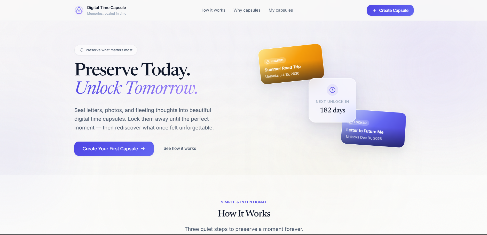
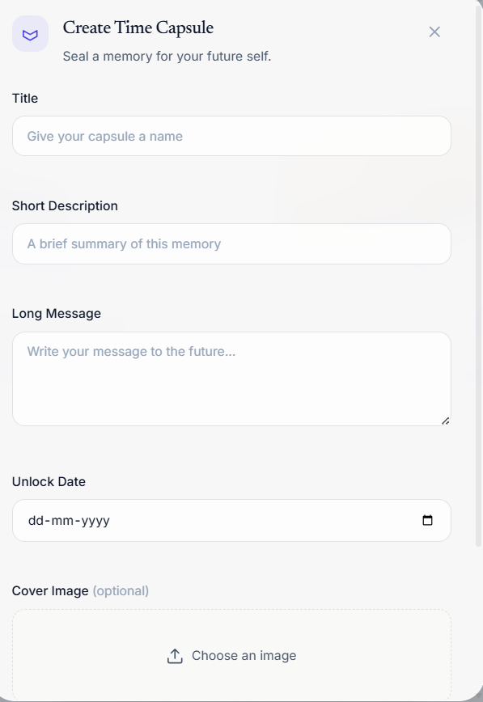
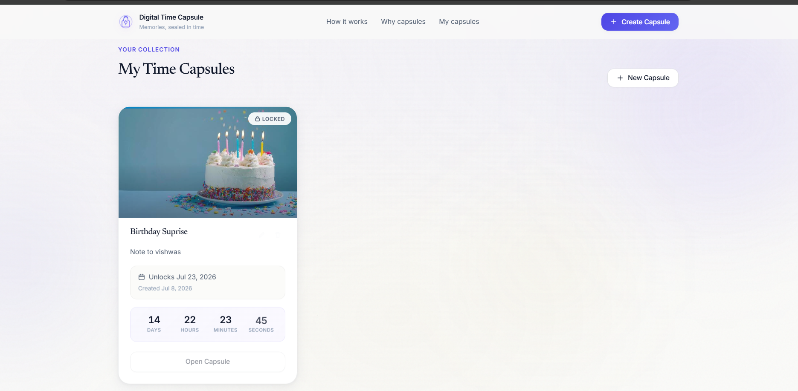

<div align="center">

# ⏳ Digital Time Capsule

### *Preserve Today. Unlock Tomorrow.*

A premium web application that lets users preserve memories, messages, and images inside digital time capsules that automatically unlock on a future date.

Built with **Vanilla JavaScript**, **HTML**, and **CSS** for **HackWeek 2026**.

---


</div>

---

# 📸 Preview

> Replace these with your screenshots after uploading them.

## Hero Section



---

## Create Capsule



---

## Capsule Collection



---

## Unlock Experience


---

# ✨ Features

## Core Features

- Create digital time capsules
- Upload cover images
- Store personal messages
- Future unlock dates
- Automatic unlock engine
- Live countdown timer
- Edit existing capsules
- Delete capsules
- LocalStorage persistence

---

## Premium Experience

- Beautiful landing page
- Animated hero section
- Interactive "How It Works"
- Wallet-inspired capsule cards
- Countdown animations
- Unlock celebration
- Fullscreen memory viewer
- Share memory as PNG
- Responsive design
- Smooth micro-interactions

---

# 🎬 How It Works

```text
Create Capsule
      │
      ▼
Choose Unlock Date
      │
      ▼
Memory is Locked
      │
      ▼
Live Countdown
      │
      ▼
Automatic Unlock
      │
      ▼
Open Memory
      │
      ▼
Relive the Moment ❤️
```

---

# 🛠 Tech Stack

| Category | Technology |
|----------|------------|
| Frontend | HTML5 |
| Styling | CSS3 |
| Programming | Vanilla JavaScript (ES Modules) |
| Storage | LocalStorage |
| Icons | SVG |
| Architecture | Modular JavaScript |

---

# 📂 Project Structure

```text
digital-time-capsule/

│
├── assets/
│
├── js/
│   ├── app.js
│   ├── capsuleManager.js
│   ├── countdownPreview.js
│   ├── memoryViewer.js
│   ├── modal.js
│   ├── renderer.js
│   ├── scrollAnimations.js
│   ├── shareCard.js
│   ├── storage.js
│   ├── timeEngine.js
│   ├── unlockExperience.js
│   ├── unlockSound.js
│   ├── utils.js
│   └── validator.js
│
├── screenshots/
│
├── index.html
├── style.css
├── script.js
├── README.md
└── LICENSE
```

---

# 🏗 Architecture

```text
script.js
      │
      ▼
app.js
      │
      ├──────────────┐
      ▼              ▼
renderer.js     capsuleManager.js
      │              │
      ▼              ▼
countdown      storage.js
      │
      ▼
timeEngine.js
      │
      ▼
unlockExperience.js
      │
      ▼
memoryViewer.js
      │
      ▼
shareCard.js
```

---

# 🚀 Getting Started

Clone the repository

```bash
git clone https://github.com/YOUR_USERNAME/digital-time-capsule.git
```

Navigate into the project

```bash
cd digital-time-capsule
```

Run a local server

```bash
python -m http.server 8080
```

Open your browser

```
http://localhost:8080
```

---

# 🎯 Project Highlights

- Modular ES Module architecture
- Premium SaaS-inspired UI
- Automatic unlock engine
- Live countdown system
- Responsive across devices
- Accessibility-friendly
- Smooth animations
- Portfolio-quality design
- No frameworks
- Pure Vanilla JavaScript

---

# 💡 Design Inspiration

The interface draws inspiration from:

- Linear
- Notion
- Apple
- Vercel
- Stripe
- Arc Browser

The goal was to create a calm, emotional, premium experience instead of a traditional dashboard.

---

# 📱 Responsive Design

Designed for:

- Desktop
- Laptop
- Tablet
- Mobile

---

# ♿ Accessibility

- Semantic HTML
- Keyboard navigation
- Visible focus states
- Escape key support
- Reduced motion support
- Responsive typography

---

# 📈 Future Improvements

- Cloud synchronization
- User authentication
- End-to-end encryption
- Email reminders
- Video & audio memories
- Progressive Web App support

---

# 📷 Screenshots

| Hero | Create Capsule |
|------|------|
|  |  |

| Capsule Collection | Unlock Experience |
|------|------|
|  |  |

---

# 👨‍💻 Author

**Vishwas Namdeo**

Built for **HackWeek 2026**.

---

# 📄 License

This project is licensed under the MIT License.

---

<div align="center">

### ⭐ If you liked this project, consider giving it a star!

Made with ❤️ for HackWeek 2026

</div>